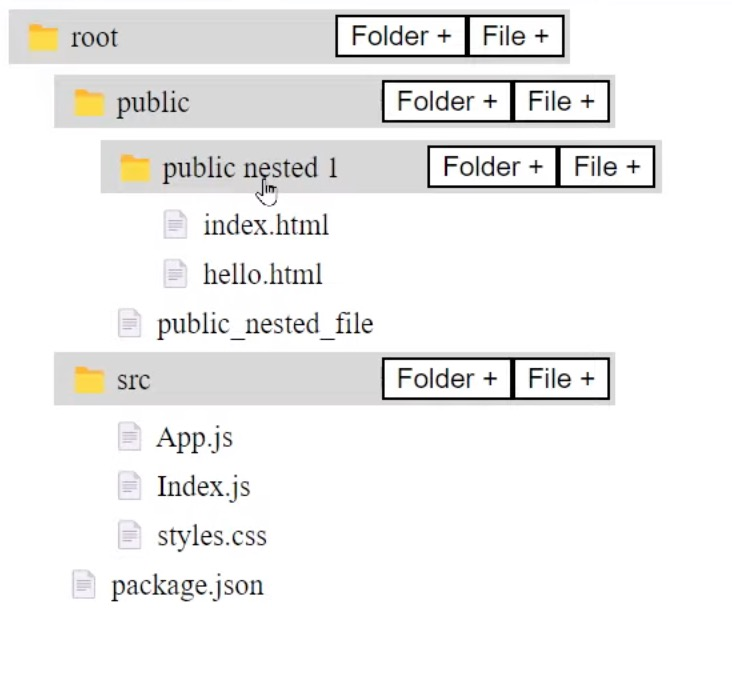

# Create A File Explorer

## Features:
1. Must get folder structure from `json` data and display it.
1. Must expand-contract the folder structure as per interaction with it
1. Should be able to create new files and folder on user interaction.

### Creating a useTree hook

### Testing a react hook ( testing useTree)

1. Install 